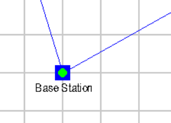
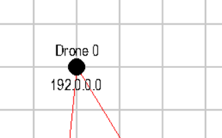
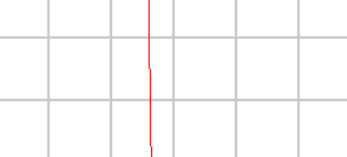

# Drone Simulation
## Overview
This is a simulation to show how the mesh network of our communication system operates in real time. 
Flight plans can be coded in to the system, and you can visually see how data is transferred between each drone.
***
### Icon Guide

 

| Object | Description | Image |
| ------ | ----------- | ----- |
| Base Station | Central immobile station   first responders will interface   with. |  |
| Drone | One of the many drones   data will be collected from   or transferred to. | | 
| Connection | A connection line established   by the mesh network through   batman-advanced. (Blue lines   simply mean the connection is   directly to the base station.)|  | 
| Packet | This represents a packet of   information that needs to be  transferred back to the base   station. | 

 

---

## How To Use
Launch droneSim.py. This will open a pygame window. Currently, there is no GUI to assign flight paths. The only inputs implemented are spacebar - which sends a packet from Drone 0, and the arrow keys, which move Drone 0 around. This is purely a proof of concept and a useful demonstration. The code will be built out soon so that it can be used as a more robust system.

There are comments inside of droneSim.py that show where and how to program flight paths or change drone sources. Some python experience is necessary.

#### NOTE:
entities.py and grid.py must be in the same folder as droneSim.py in order for the application to run. 
